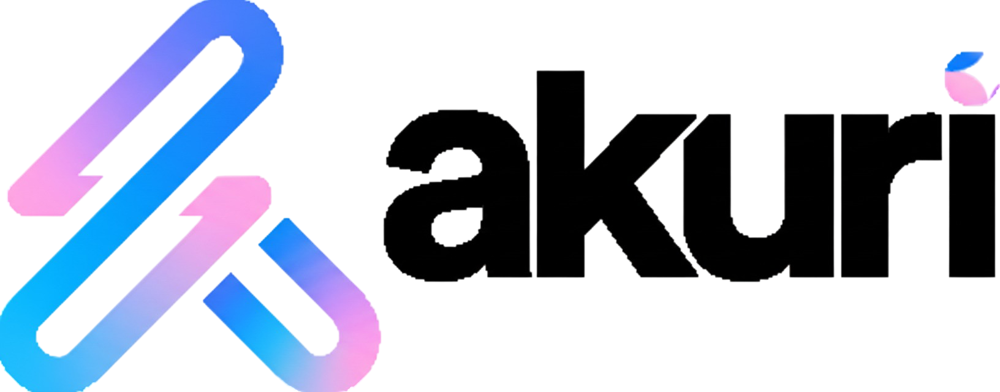

 

 

# Cómo Contribuir a Akuri-OMA

¡Antes que nada, gracias por considerar contribuir a la metodología Akuri-OMA! Tu participación nos ayuda a construir un marco de trabajo más robusto, versátil y eficaz para el desarrollo de software asistido por IA.

Damos la bienvenida a todo tipo de contribuciones, desde corregir errores tipográficos en la documentación hasta proponer cambios importantes en los flujos de trabajo o adaptar la metodología a nuevas tecnologías.

## Código de Conducta

Este proyecto y todos sus participantes se rigen por un [Código de Conducta](CODE_OF_CONDUCT.md). Al participar, se espera que respetes este código. Por favor, reporta cualquier comportamiento inaceptable.

## ¿Cómo Puedo Contribuir?

Hay muchas maneras en las que puedes contribuir al proyecto:

### Reportando Errores o Sugiriendo Mejoras
- **Reportar un error:** Si encuentras un fallo, una inconsistencia o una sección poco clara en nuestra documentación o en los proyectos de ejemplo, por favor [abre un "issue"](https://github.com/tu-usuario/akuri-oma-methodology/issues).
- **Sugerir una mejora:** Si tienes una idea para una nueva característica, un nuevo `guideline` o una forma de mejorar un flujo de trabajo existente, nos encantaría escucharla. Por favor, [abre un "issue"](https://github.com/tu-usuario/akuri-oma-methodology/issues) para iniciar la discusión.

### Proponiendo Cambios con "Pull Requests"

Si quieres realizar un cambio tú mismo, el proceso general es:

1.  **Haz un "Fork" del repositorio** y crea una nueva rama desde `main`.
2.  **Realiza tus cambios.** Por favor, asegúrate de que tus cambios sean consistentes con la filosofía general de la metodología.
3.  **Envía un "Pull Request" (PR).** En la descripción de tu PR, por favor, explica el "porqué" de tu cambio y enlázalo a cualquier "issue" relevante.

### Tipos de Contribuciones que Buscamos

#### 1. Mejoras en la Documentación
-   Aclarar explicaciones en la carpeta `docs/`.
-   Corregir errores tipográficos y gramaticales.
-   Añadir más ejemplos a los `guidelines`.

#### 2. Traducciones
-   La documentación principal está en español e inglés. Estaríamos encantados de recibir contribuciones para traducir la carpeta `/docs/` a otros idiomas (ej., `/docs/pt/`, `/docs/de/`).

#### 3. Adaptación a Nuevas Tecnologías
-   ¡Esta es una de las contribuciones más valiosas! Si eres un experto en una tecnología como **React, Vue, Svelte, Django, Ruby on Rails, etc.**, puedes ayudar de la siguiente manera:
    1.  Abriendo un "issue" para discutir cómo se pueden adaptar los principios de Akuri-OMA a esa pila tecnológica.
    2.  Creando un nuevo conjunto de `guidelines` para esa tecnología dentro de la carpeta `/examples/[nombre-tecnologia]/`.
    3.  Una vez validado, podemos integrarlo en la metodología principal.

#### 4. Mejora de los Proyectos de Ejemplo
-   Mejorar los proyectos `akuri-oma-example-nestjs` o `akuri-oma-example-angular` para demostrar mejor un principio.
-   Añadir nuevas funcionalidades a los proyectos de ejemplo que muestren casos de uso más avanzados de la metodología.

## Para Empezar

Antes de comenzar, por favor, tómate un momento para leer la documentación principal y entender la filosofía detrás de Akuri-OMA. El mejor lugar para empezar es la **[Introducción a Akuri-OMA](./docs/es/01-akuri-oma-intro.es.md)**.

¡Esperamos tus contribuciones!