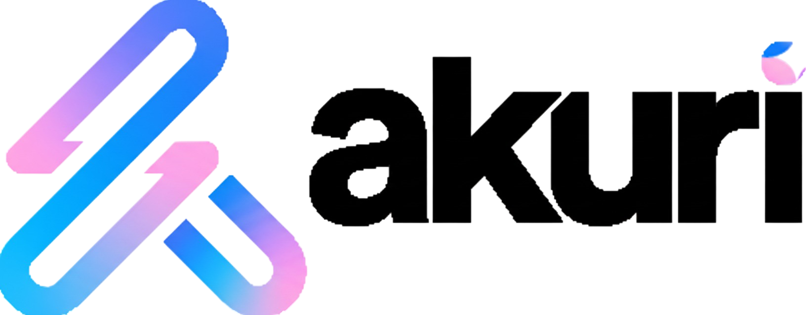

<br />
<hr />
<br />

# Guía de Inicio Rápido de Akuri-OMA

¡Bienvenido a Akuri-OMA! Esta guía te mostrará cómo configurar tu primer proyecto para usar la metodología en menos de 5 minutos.

## ¿Qué es Akuri-OMA?

Es una metodología de **Desarrollo Guiado por Especificaciones (SDD)** diseñada para trabajar con agentes de IA. En lugar de dar órdenes directas, tú y la IA colaboran para crear especificaciones detalladas que luego se convierten en código de alta calidad. Para más detalles, lee la [Introducción a Akuri-OMA](./docs/es/00_Introduccion_a_Akuri_OMA.md).

## Paso 1: Configurar la Estructura de Carpetas `.akuri`

La metodología Akuri-OMA vive en una carpeta `.akuri` en la raíz de tu plataforma.

1.  **Crea la Carpeta Raíz:** En la raíz de tu repositorio (monorepo), crea la carpeta `.akuri`.

2.  **Copia la Estructura Base:** Clona o copia la estructura de `guidelines`, `prompts` y `docs` de este repositorio dentro de tu nueva carpeta `.akuri`. Tu estructura inicial debería verse así:

    ```
    TU_PROYECTO/
    └── .akuri/
        ├── akuri-docs/         # Contiene el glosario y la documentación.
        ├── akuri-guidelines/   # Contiene todas las reglas y workflows.
        ├── akuri-manifest/     # (Vacío por ahora)
        └── akuri-prompts/      # Contiene las plantillas de prompts.
    ```

## Paso 2: Crear el Manifiesto de tu Plataforma

El `platform.manifest.md` es el "cerebro" que le dice al agente qué proyectos existen.

1.  **Crea el Archivo:** Dentro de `.akuri/akuri-manifest/`, crea un archivo llamado `platform.manifest.md`.

2.  **Añade el Contenido:** Pega la siguiente plantilla y adáptala a tus proyectos.

    ```markdown
    ---
    description: Manifiesto de Mi Plataforma.
    ---

    ## Manifiesto de Plataforma

    ### Proyectos

    -   **`mi-proyecto-backend/`:**
        -   **Rol:** Backend API
        -   **Tecnología:** [ej. NestJS, Django]
        -   **`api_docs_url`:** [ej. http://localhost:3000/api-docs]

    -   **`mi-proyecto-frontend/`:**
        -   **Rol:** Frontend Web
        -   **Tecnología:** [ej. Angular, React]
        -   **Depende de:** `mi-proyecto-backend/`
    ```

## Paso 3: Configurar el "Cargador de Arranque" (Bootstrap) de tu Agente

Para "activar" Akuri en tu gestor de IA (Cursor, VSCode Copilot, etc.), necesitas indicarle que lea las reglas.

1.  **Localiza la Carpeta de Reglas de tu Agente:** Cada gestor tiene una carpeta donde puedes añadir archivos de contexto o reglas (a menudo llamada `.vscode`, `.cursor-rules`, etc.).

2.  **Crea el Archivo Bootstrap:** Dentro de esa carpeta, crea un archivo (ej., `00-akuri-bootstrap.md`) y pega el siguiente contenido:

    ```markdown
    # Directiva de Arranque de la Metodología Akuri

    Tu primera y más importante directiva es localizar y operar dentro del ecosistema de la Metodología Akuri.

    1.  **Localiza la Carpeta Raíz:** Tu primera acción es identificar la carpeta raíz que contiene la subcarpeta `.akuri/`.
    2.  **Carga la Regla Maestra:** Tu contexto operativo principal está definido por el documento:
        `./.akuri/akuri-guidelines/1_platform/global-rules.guideline.md`
    3.  **Adhiérete a las Reglas:** A partir de este momento, todas tus acciones deben regirse por las reglas y flujos de trabajo de Akuri-OMA.
    ```

## Paso 4: ¡Inicia tu Primera Tarea!

¡Ya estás listo! Ahora puedes empezar a trabajar.

1.  **Copia el Prompt de Inicio:** Abre el archivo `.akuri/akuri-prompts/start-task.prompt.md`.
2.  **Pégalo en el Chat:** Pega el contenido en tu chat con la IA.
3.  **Comienza el Diálogo:** El agente te hará una serie de preguntas para iniciar tu primera tarea (ej., `BUILD` o `AUDIT`) de manera estructurada.

¡Bienvenido al Desarrollo Guiado por Especificaciones!